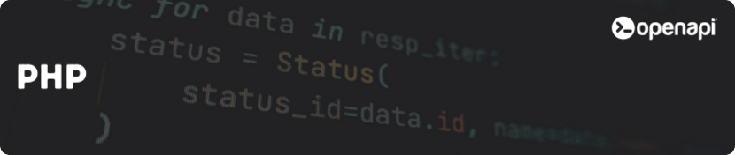

<div align="center">
  <a href="https://openapi.com/">
    
  </a>

  <h1>Openapi® client for PHP</h1>
  <h4>The perfect starting point to integrate <a href="https://openapi.com/">Openapi®</a> within your PHP project</h4>

[](https://github.com/openapi/openapi-php-sdk/actions/workflows/php.yml)
[](https://packagist.org/packages/openapi/openapi-sdk)
[](https://packagist.org/packages/openapi/openapi-sdk)
[](LICENSE)
[](https://packagist.org/packages/openapi/openapi-sdk)
<br>
[](https://www.linuxfoundation.org/about/members)

</div>

## Overview

A minimal and agnostic PHP SDK for Openapi, inspired by a clean client implementation. This SDK provides only the core HTTP primitives needed to interact with any Openapi service.

## Pre-requisites

Before using the Openapi PHP Client, you will need an account at [Openapi](https://console.openapi.com/) and an API key to the sandbox and/or production environment

## Features

- **Agnostic Design**: No API-specific classes, works with any OpenAPI service
- **Minimal Dependencies**: Only requires PHP 8.0+ and cURL
- **OAuth Support**: Built-in OAuth client for token management
- **HTTP Primitives**: GET, POST, PUT, DELETE, PATCH methods
- **Clean Interface**: Similar to the Rust SDK design

## What you can do

With the Openapi PHP Client, you can easily interact with a variety of services in the Openapi Marketplace. For example, you can:

- 📩 **Send SMS messages** with delivery reports and custom sender IDs
- 💸 **Process bills and payments** in real time via API
- 🧾 **Send electronic invoices** securely to the Italian Revenue Agency
- 📄 **Generate PDFs** from HTML content, including JavaScript rendering
- ✉️ **Manage certified emails** and legal communications via Italian Legalmail

For a complete list of all available services, check out the [Openapi Marketplace](https://console.openapi.com/) 🌐

## Installation

You can add the Openapi PHP Client to your project with the following command:

```bash
composer require openapi/openapi-sdk
```

## Quick Start

### Token Generation

```php
use OpenApi\OauthClient;

$oauthClient = new OauthClient('username', 'apikey', true); // true for test environment

$scopes = [
    'GET:test.imprese.openapi.it/advance',
    'POST:test.postontarget.com/fields/country'
];

$result = $oauthClient->createToken($scopes, 3600);
$tokenData = json_decode($result, true);
$token = $tokenData['token'];
```

### Making API Calls

```php
use OpenApi\Client;

$client = new Client($token);

// GET request
$params = ['denominazione' => 'Stellantis', 'provincia' => 'TO'];
$response = $client->get('https://test.company.openapi.com/IT-advanced', $params);

// POST request
$payload = ['limit' => 10, 'query' => ['country_code' => 'IT']];
$response = $client->post('https://test.postontarget.com/fields/country', $payload);

// Other HTTP methods
$response = $client->put($url, $payload);
$response = $client->delete($url);
$response = $client->patch($url, $payload);
```

## Custom HTTP Clients (Guzzle, Laravel, etc.)

By default, the SDK uses an internal cURL-based transport.
However, you can now inject your own HTTP client, allowing full control over the request pipeline.

This is especially useful in frameworks like Laravel, where you may want to reuse an existing HTTP client with middleware such as retry, caching, logging, or tracing.

Using a custom HTTP client (e.g. Guzzle)

You can pass any PSR-18 compatible client (such as Guzzle) directly to the SDK:

```php
use OpenApi\Client;
use GuzzleHttp\Client as GuzzleClient;

$guzzle = new GuzzleClient([
    'timeout' => 10,
    // You can configure middleware, retry logic, caching, etc. here
]);

$client = new Client($token, $guzzle);

$response = $client->get('https://test.company.openapi.com/IT-advanced', [
    'denominazione' => 'Stellantis',
]);
```

### Why this matters

When using the default transport, requests are executed via cURL and bypass any framework-level HTTP configuration.

By injecting your own client, you can:

- ✅ Reuse your existing HTTP middleware stack (e.g. Laravel retry/cache)
- ✅ Centralize logging, tracing, and observability
- ✅ Apply custom headers, timeouts, or authentication strategies
- ✅ Maintain consistency with your application's HTTP layer

### Custom Transport Interface

If needed, you can also implement your own transport by using the provided interface:

```php
use OpenApi\Interfaces\HttpTransportInterface;

class MyTransport implements HttpTransportInterface
{
    public function request(
        string $method,
        string $url,
        mixed $payload = null,
        ?array $params = null
    ): string {
        // Your custom implementation
    }
}
```

And inject it:

```php
$client = new Client($token, new MyTransport());
```

## Architecture

This SDK follows a minimal approach with only essential components:

- `OauthClient`: Handles OAuth authentication and token management
- `Client`: Agnostic HTTP client for API calls
- `Exception`: Error handling
- `Cache\CacheInterface`: Optional caching interface

## Requirements

- PHP 8.0 or higher
- cURL extension
- JSON extension

## Examples

You can find complete examples in the `examples/` directory:

- `examples/token_generation.php` - OAuth token generation example
- `examples/api_calls.php` - HTTP API calls example
- `examples/complete_workflow.php` - End-to-end workflow example

Run examples with:

```bash
composer run example:token
composer run example:api
composer run example:complete
```

## Testing

Run tests with:

```bash
# Run all tests
composer run test

# Run unit tests specifically
composer run test:unit
```

## Contributing

Contributions are always welcome! Whether you want to report bugs, suggest new features, improve documentation, or contribute code, your help is appreciated.

See [docs/contributing.md](docs/contributing.md) for detailed instructions on how to get started. Please make sure to follow this project's [docs/code-of-conduct.md](docs/code-of-conduct.md) to help maintain a welcoming and collaborative environment.

## Authors

Meet the project authors:

- L. Paderi ([@lpaderiAltravia](https://www.github.com/lpaderiAltravia))
- Openapi Team ([@openapi-it](https://github.com/openapi-it))

## Partners

Meet our partners using Openapi or contributing to this SDK:

- [Blank](https://www.blank.app/)
- [Credit Safe](https://www.creditsafe.com/)
- [Deliveroo](https://deliveroo.it/)
- [Gruppo MOL](https://molgroupitaly.it/it/)
- [Jakala](https://www.jakala.com/)
- [Octotelematics](https://www.octotelematics.com/)
- [OTOQI](https://otoqi.com/)
- [PWC](https://www.pwc.com/)
- [QOMODO S.R.L.](https://www.qomodo.me/)
- [SOUNDREEF S.P.A.](https://www.soundreef.com/)

## Our Commitments

We believe in open source and we act on that belief. We became Silver Members
of the Linux Foundation because we wanted to formally support the ecosystem
we build on every day. Open standards, open collaboration, and open governance
are part of how we work and how we think about software.

## License

This project is licensed under the [MIT License](LICENSE).

The MIT License is a permissive open-source license that allows you to freely use, copy, modify, merge, publish, distribute, sublicense, and/or sell copies of the software, provided that the original copyright notice and this permission notice are included in all copies or substantial portions of the software.

In short, you are free to use this SDK in your personal, academic, or commercial projects, with minimal restrictions. The project is provided "as-is", without any warranty of any kind, either expressed or implied, including but not limited to the warranties of merchantability, fitness for a particular purpose, and non-infringement.

For more details, see the full license text at the [MIT License page](https://choosealicense.com/licenses/mit/).
